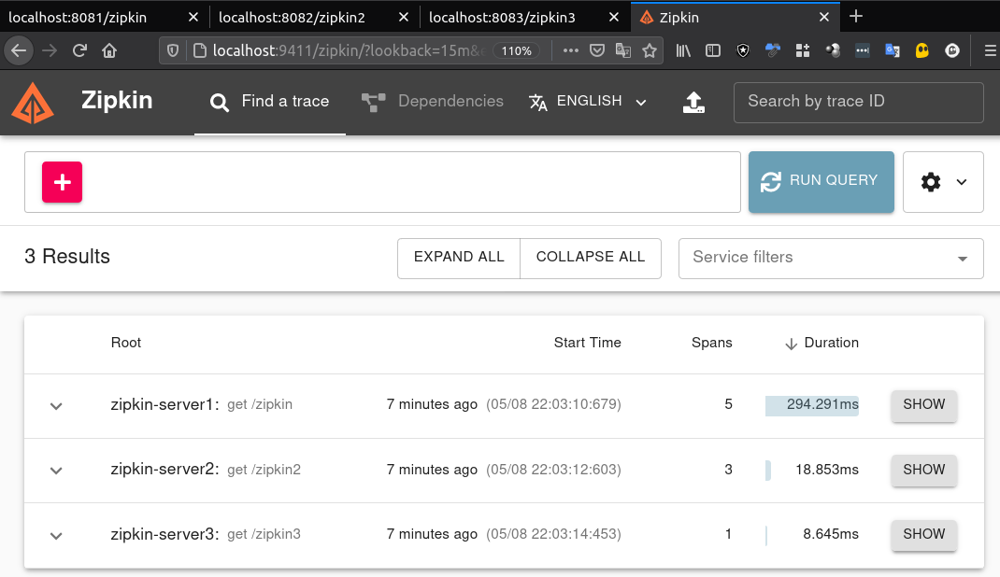
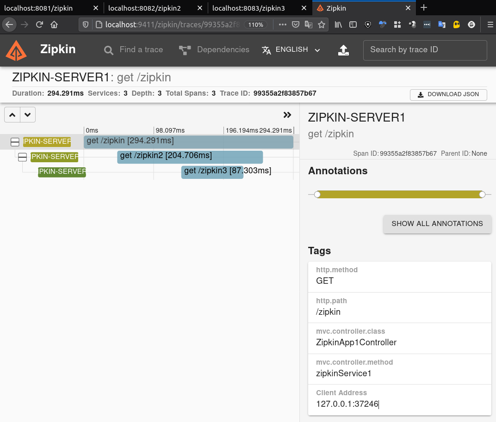
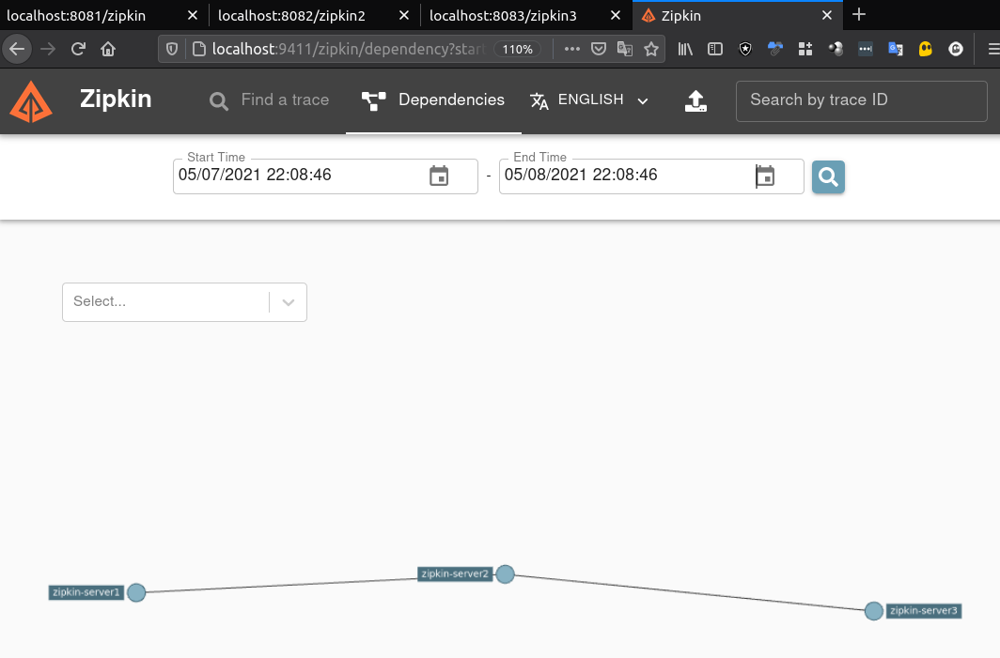

# Laboratorio de Spring-boot com Zipkin

Teste de springboot com zipkin

## Links

[zipkin quickstart](https://zipkin.io/pages/quickstart)

## Cenario

O Microservico 1 chama o 2 que chama o 3 e finaliza.

Usei o docker para subir a interface:

```shell
docker run -d -p 9411:9411 openzipkin/zipkin
```

## Dashboard

### Trace


### Trace Detail


### Dependences
